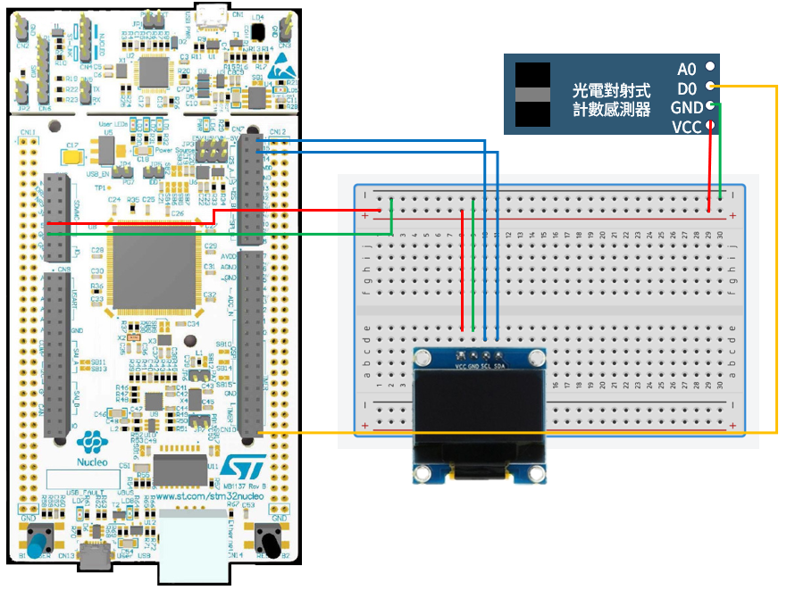

# STM32 Project - external-interrupt

這是一個用於 STM32F4 系列微控制器的示例項目，旨在設定內部中斷並讓 OLED 顯示資料。

## 硬件要求

- STM32F429ZIT6 微控制器
- OLED 0.96 I2C
- 光電對射式計數感測器

## 軟件依賴

- STM32CubeIDE

## 學習目標

- 學習設定內部中斷

## 電路圖

## 構建和編譯

1. 將資料夾放入 STM32CubeIDE 的 WorkSpace 中
2. 在 STM32CubeIDE 中打開 .cproject
3. 編譯並燒寫至您的微控制器

## 使用方法

將編譯好的程序燒寫到 STM32 微控制器後，使用物品阻擋感測器，OLED 中的數字會+1。

## 程式設定討論

- 在 stm32f4xx_it.c 的第 212 行中，添加 if 判斷式，是因為不管如何設定上升電位和下降電位都會觸發中斷，所以需修改程式。當設定為 GPIO_PIN_SET 時為下降電位觸發、GPIO_PIN_RESET 時為上升電位觸發
- 在 stm32f4xx_it.c 的第 210 行中，HAL_Delay(1)是為了消除抖動。雖然知道在中斷中加入 Delay()不是好的選擇，但是以目前的能力只能暫時這樣了。
